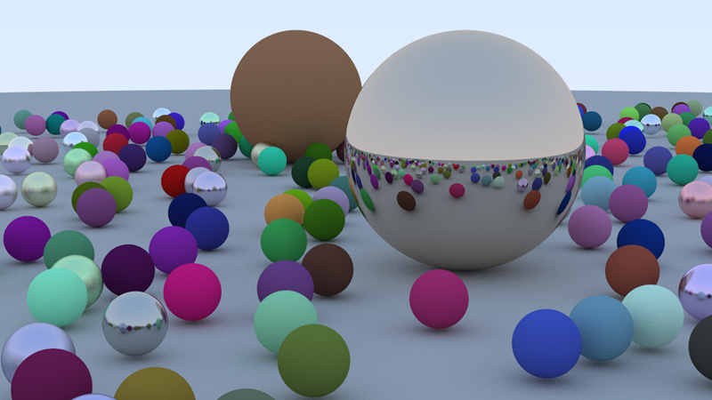
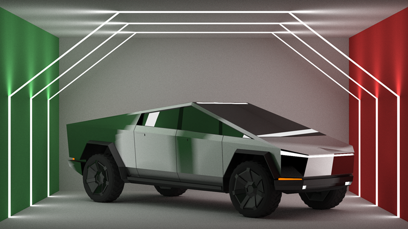

# C++ Ray Tracer

A compact, educational ray tracer written in modern C++ that renders spheres and triangle meshes with Lambertian and metal materials, emissive lights, a BVH accelerator, and multi‑threaded rendering. Scenes and camera settings can be loaded from simple text files.

---

## Features

* **Materials:** `lambertian` (diffuse), `metal` (fuzzy reflections), `diffuse_light` (emissive)
* **Geometry:** spheres, triangles, OBJ loader (positions only)
* **Acceleration:** AABB and **BVH** for fast ray–scene intersection
* **Camera:** position/orientation (lookfrom/lookat/vup), FOV, background color
* **Sampling:** stochastic anti‑aliasing (samples per pixel), recursion depth control
* **Rendering:** ASCII **PPM (P3)** to `stdout` or multi‑threaded framebuffer → `stdout`
* **Scene IO:** `scene.txt` (objects) and `camera_settings.txt` (camera)
* **Clean headers:** small, focused classes

---

## Quick Start

### Prerequisites

* A C++17 (or later) compiler (MSVC, Clang, or GCC)
* **CMake 3.10+**
* (Optional) **VS Code** with CMake Tools extension

### Build (cross‑platform, out‑of‑source)

```bash
# from project root
cmake -S . -B build -DCMAKE_BUILD_TYPE=Release
cmake --build build --config Release
```

The executable will land in something like:

* **Windows (MSVC):** `build/Release/<exe>`
* **Linux/macOS:** `build/<exe>`

### Run

The renderer writes **PPM (P3)** to standard output. Redirect it to a file:

```bash
# Windows (PowerShell)
./build/Release/raytracer.exe > out.ppm

# Linux/macOS
./build/raytracer > out.ppm
```

Open `out.ppm` with an image viewer that supports PPM.

---

## Project Layout

```
src/
  main.cpp           # choose a scene and render
  camera.h           # handling the rendering and camera settings
  ray_tracer.h       # common utilities, constants, random helpers
  vector3.h          # 3D vector math
  color.h            # color helpers + gamma correction (PPM output)
  ray.h              # ray class
  interval.h         # numeric interval utility
  aabb.h             # axis‑aligned bounding boxes
  hittable.h         # base interface + hit_record
  hittable_list.h    # container of hittables
  sphere.h           # sphere primitive
  tri.h              # triangle primitive
  material.h         # lambertian, metal, diffuse_light
  bvh.h              # BVH accelerator
  input.h            # load_scene_from_file, load_obj_file, set_camera
  log.h              # render time logger
```

---

## Scenes & Camera Files

### `scene.txt`

Each non‑empty line defines an object. Supported:

* **Sphere:**

  ```
  sphere x y z radius MATERIAL r g b [fuzz]
  ```

  Materials: `lambertian`, `metal` (requires `fuzz`), `light` (emissive).
* **OBJ mesh:**

  ```
  obj path/to/model.obj MATERIAL r g b [fuzz]
  ```

**Example:**

```txt
# ground + three spheres + an OBJ
sphere 0 -100.5 -1   100  lambertian 0.1 0.2 0.5
sphere 0    0   -1   0.5  lambertian 0.5 0.1 0.1
sphere -1   0   -1   0.5  metal      0.8 0.8 0.8  0.1
sphere  1   0   -1   0.5  metal      0.8 0.6 0.2  1.0
obj     obj/model.obj lambertian 0.5 0.1 0.1
```

### `camera_settings.txt`

Supported keys (order doesn’t matter):

```txt
aspect_ratio       1.7777778
image_width        400
samples_per_pixel  100
max_depth          20
vfov               40
lookfrom           0 2 5
lookat             0 0 0
vup                0 1 0
background         0.7 0.8 1.0
```

> The code reads numbers; for `aspect_ratio` prefer a decimal (e.g., `1.7777778`).

---

## Choosing a Scene in `main`

`main.cpp` contains several scene functions and a `switch` to pick one:

```cpp
switch (6) {
  case 1: many_spheres(); break;
  case 2: three_spheres(); break;
  case 3: tris(); break;
  case 4: custom_scene(); break; // uses scene & camera files
}
```

Set the desired case and rebuild.

---

## Parallel Rendering

`camera::render_parallel()` splits the image into row blocks across `std::thread::hardware_concurrency()` threads, stores colors in a 2D framebuffer, and writes PPM from the main thread to avoid interleaved output.

---

## OBJ Loader Notes

* Currently parses **vertex** (`v`) and **face** (`f`) lines (triangles only; 1‑based indices).
* No normals/UVs or materials from MTL—materials are assigned per‑object line in `scene.txt`.

---

## Example Renders

|      Many Spheres       |        Custom Scene       |
| ----------------------- | ------------------------- |
|||

---

## License

```
MIT License © Shayan Masoudzadeh
```

---

## Acknowledgments

This project was developed as part of a university final project.

Special thanks to:
* **Peter Shirley**’s Ray Tracing in One Weekend book series.
* **Gabriel Gambetta**’s Computer Graphics from Scratch.
* **Dr. Mohammad Maghsoudloo**, for guidance and support during the project.

Additional thanks to the open‑source graphics community for inspiration and resources.
